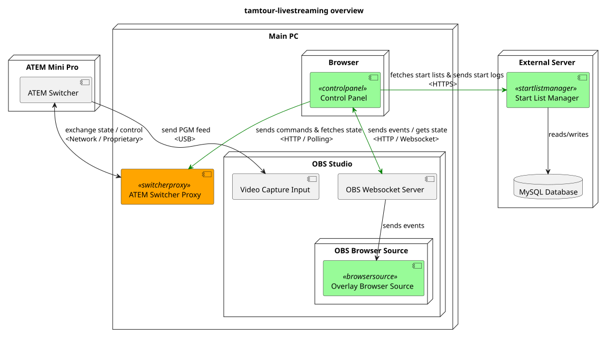

# Architecture overview

The following diagram gives a general idea of the architecture (audio not shown):

The control panel sends commands to the OBS Studio websocket
server ([obs-websocket](https://github.com/obsproject/obs-websocket))
via [obs-websocket-js](https://github.com/obs-websocket-community-projects/obs-websocket-js). The browser
source ([obs-browser](https://github.com/obsproject/obs-browser)) receives the commands as events and displays the
overlay accordingly.
